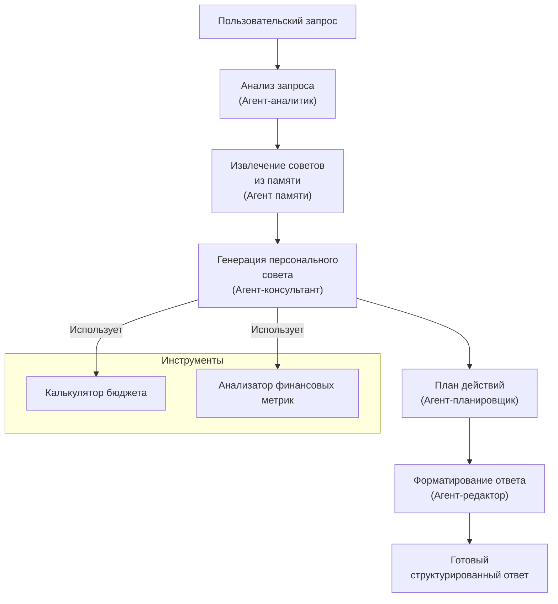

# Prompt для chai.new

Cоздай агента финансового советника 

Data Collection: Users enter financial information (income, expenses, debts) either manually or via CSV upload.

Agent Chain Execution: workflow agent executes its sub-agents in the order they are specified in the list:

Budget Analysis Agent evaluates spending patterns and identifies areas for reduction

Savings Strategy Agent develops savings plans based on budget analysis

Debt Reduction Agent creates optimized debt payoff strategies using both analytical methods

State Management: Each agent stores its results in the shared session state, allowing subsequent agents to build upon prior analysis. This state-passing mechanism enables a coherent analysis pipeline without duplicating work.

# Блок схема решения


# Советы из памяти

## Рекомендации по анализу бюджета

### Правило 50/30/20
- 50% дохода на необходимые расходы (жилье, еда, коммунальные услуги)
- 30% на желания (развлечения, рестораны)
- 20% на сбережения и погашение долгов

### Распространенные области для сокращения бюджета
- **Подписки на сервисы**: Пересмотрите и отмените неиспользуемые подписки (стриминговые сервисы, приложения, журналы)
- **Расходы на питание**: Планирование питания и сокращение посещений ресторанов может сэкономить до 30% бюджета на еду
- **Транспорт**: Рассмотрите возможность совместных поездок или общественного транспорта вместо личного автомобиля
- **Энергозатраты**: Сократите использование коммунальных услуг с помощью энергоэффективных приборов и разумного потребления
- **Страхование**: Ежегодно ищите лучшие тарифы и рассмотрите возможность объединения полисов для скидок
- **Мобильная связь и интернет**: Пересмотрите тарифные планы и выберите оптимальные для вашего потребления
- **Покупки**: Используйте кэшбэк-сервисы, сравнивайте цены и покупайте по акциям

### Методы ведения бюджета
- **Метод конвертов**: Распределите наличные по конвертам для разных категорий расходов
- **Цифровые приложения**: Используйте приложения для отслеживания расходов и автоматической категоризации
- **Нулевой бюджет**: Распределите каждый рубль дохода по категориям, чтобы разница между доходами и расходами была равна нулю
- **Бюджет на основе ценностей**: Сосредоточьте расходы на том, что действительно важно для вас, и сократите остальное

### Анализ соотношений
- **Жилье**: Не должно превышать 30% от дохода после налогов
- **Транспорт**: Не более 15% от дохода
- **Долговая нагрузка**: Общие выплаты по долгам не должны превышать 40% от дохода
- **Сбережения**: Минимум 10% дохода должно идти на сбережения
  `);


## Стратегии сбережений

### Резервный фонд
- **Объем**: Создайте запас на 3-6 месяцев основных расходов
- **Где хранить**: Используйте сберегательный счет с высокой доходностью для доступности
- **Как накопить**: Начните с небольшой суммы (например, 5% дохода) и постепенно увеличивайте
- **Приоритет**: Формирование резервного фонда должно быть приоритетом №1 перед другими финансовыми целями

### Пенсионные накопления
- **Корпоративные программы**: Вносите взносы в пенсионные программы работодателя хотя бы до уровня софинансирования
- **Индивидуальные инвестиционные счета (ИИС)**: Используйте для получения налоговых вычетов
- **Негосударственные пенсионные фонды (НПФ)**: Рассмотрите как дополнение к государственной пенсии
- **Объем**: Стремитесь откладывать 15% дохода на пенсию
- **Стратегия**: Чем моложе, тем более агрессивный портфель можно формировать

### Краткосрочные сбережения (1-3 года)
- **Раздельные счета**: Используйте отдельные счета для разных целей (отпуск, ремонт, покупка техники)
- **Автоматизация**: Настройте автоматические переводы в день зарплаты
- **Инструменты**: Рассмотрите депозиты, накопительные счета, краткосрочные облигации
- **Правило 72 часов**: Подождите 72 часа перед крупной незапланированной покупкой

### Среднесрочные сбережения (3-10 лет)
- **Цели**: Первоначальный взнос за жилье, образование, открытие бизнеса
- **Инструменты**: Сбалансированный портфель из облигаций и акций, ИИС, структурные продукты
- **Стратегия**: Постепенно снижайте риск по мере приближения к цели

### Долгосрочные сбережения (более 10 лет)
- **Диверсификация**: Распределите инвестиции между разными классами активов
- **Регулярность**: Используйте стратегию усреднения (покупка на фиксированную сумму регулярно)
- **Реинвестирование**: Реинвестируйте полученные дивиденды и проценты
- **Пересмотр**: Ежегодно пересматривайте и ребалансируйте портфель

### Психология сбережений
- **Визуализация целей**: Создайте визуальные напоминания о ваших финансовых целях
- **Правило "заплати сначала себе"**: Откладывайте деньги сразу после получения дохода
- **Челлендж экономии**: Попробуйте месяц экономии, когда тратите только на самое необходимое
- **Отслеживание прогресса**: Регулярно отмечайте достижения на пути к финансовым целям
  `);


## Стратегии сокращения долга

### Метод лавины (Avalanche Method)
- **Принцип**: Платите минимум по всем долгам, направляя дополнительные деньги на долг с самым высоким процентом
- **Преимущества**: Математически оптимальный подход, минимизирует общую сумму процентных платежей
- **Недостатки**: Может быть психологически сложнее, если высокопроцентные долги имеют большие суммы
- **Кому подходит**: Дисциплинированным людям, ориентированным на максимальную финансовую эффективность

### Метод снежного кома (Snowball Method)
- **Принцип**: Платите минимум по всем долгам, направляя дополнительные деньги на долг с наименьшим балансом
- **Преимущества**: Создает психологические победы, повышает мотивацию, быстро уменьшает количество долгов
- **Недостатки**: Математически менее эффективен, может привести к большим процентным платежам
- **Кому подходит**: Людям, которым важны быстрые результаты и психологическое удовлетворение

### Консолидация долга
- **Принцип**: Объединение нескольких долгов в один с более низкой процентной ставкой
- **Варианты**: Кредит на рефинансирование, перевод баланса на карту с 0% ставкой, потребительский кредит
- **Преимущества**: Упрощает управление долгами, может снизить общую процентную ставку
- **Предостережения**: Обратите внимание на комиссии, скрытые платежи и условия после льготного периода
- **Критерии выбора**: Новая ставка должна быть значительно ниже средневзвешенной ставки по текущим долгам

### Переговоры с кредиторами
- **Снижение ставки**: Позвоните кредиторам и попросите о снижении процентной ставки
- **Планы погашения**: Обсудите возможность реструктуризации долга или создания плана погашения
- **Урегулирование**: В сложных случаях предложите единовременный платеж в счет полного погашения долга
- **Подготовка**: Перед звонком изучите свою кредитную историю и текущие рыночные ставки

### Приоритизация долгов
- **Высокопроцентные долги**: Кредитные карты, микрозаймы, потребительские кредиты без обеспечения
- **Среднепроцентные долги**: Автокредиты, образовательные кредиты
- **Низкопроцентные долги**: Ипотека, некоторые образовательные кредиты

### Психологические аспекты погашения долгов
- **Визуализация прогресса**: Создайте график погашения долга и отмечайте прогресс
- **Празднование вех**: Отмечайте важные этапы погашения долга (25%, 50%, 75%, 100%)
- **Группы поддержки**: Присоединитесь к сообществам людей, погашающих долги
- **Избегание новых долгов**: Определите триггеры, которые приводят к заимствованиям, и разработайте стратегии их преодоления
  `);

## Инвестиционные стратегии

### Основы инвестирования
- **Диверсификация**: Распределяйте инвестиции между разными классами активов, секторами и географическими регионами
- **Долгосрочный подход**: Инвестируйте с горизонтом не менее 5-10 лет для сглаживания рыночных колебаний
- **Регулярность**: Используйте стратегию усреднения стоимости (покупка на фиксированную сумму регулярно)
- **Реинвестирование**: Реинвестируйте дивиденды и проценты для использования силы сложного

# Примеры вопросов к финансовому советнику

## Пример 1: Анализ бюджета
```
Я зарабатываю 150000 рублей в месяц. Моя аренда составляет 45000 рублей, платеж за машину 12000 рублей, коммунальные услуги 9000 рублей, продукты 18000 рублей, рестораны 12000 рублей, развлечения 9000 рублей, и у меня есть студенческий кредит с минимальным платежом 9000 рублей под 5% годовых с остатком 600000 рублей. Как я могу улучшить свой бюджет?
```

## Пример 2: Стратегия сбережений
```
Я хочу накопить 300000 рублей на первоначальный взнос за квартиру в течение следующих 2 лет. В настоящее время я зарабатываю 135000 рублей в месяц с расходами 114000 рублей, включая выплаты по долгам. Какая лучшая стратегия?
```

## Пример 3: Сокращение долга
```
У меня 3 кредитные карты: 150000 рублей под 22% годовых с минимальным платежом 4500 рублей, 90000 рублей под 18% с минимальным платежом 2700 рублей и 30000 рублей под 15% с минимальным платежом 900 рублей. У меня также есть студенческий кредит в размере 450000 рублей под 5% с минимальным платежом 5400 рублей. Мой ежемесячный доход составляет 126000 рублей, а расходы, исключая долги, составляют 84000 рублей. Какой лучший способ погасить мои долги?
```
# Схема финансового советника с блоком-интервью

# Вопросы, которые тригернут интервьювера
Вот несколько примеров запросов, которые заставят интервьюера сработать и начать задавать вам наводящие вопросы:
1. `Хочу начать откладывать деньги, что посоветуете?`
2. `Как мне лучше распорядиться своими финансами?`
3. `Помогите составить бюджет`
4. `Хочу погасить кредиты, с чего начать?`
5. `Как накопить на квартиру?`
6. `Нужен совет по управлению деньгами`
7. `Как правильно инвестировать?`
8. `Помогите разобраться с моими долгами`
9. `Хочу создать финансовый план`
10. `Как мне улучшить свое финансовое положение?`

